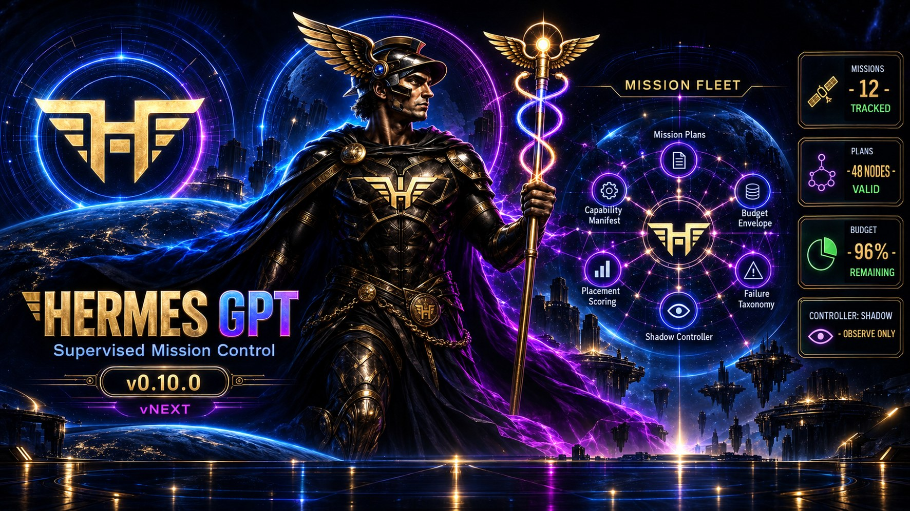

# hermes-gpt

[](https://pypi.org/project/hermes-gpt/)
[](https://pypi.org/project/hermes-gpt/)



`hermes-gpt` is a local-first MCP sidecar for Hermes Agent. It exposes selected Hermes capabilities to trusted MCP clients without modifying Hermes Agent source files.

## Current status

- **Repository version:** 0.10.0
- **GitHub release target:** v0.10.0
- **Latest PyPI release:** check the badge above; PyPI is published independently from GitHub
- **Python requirement:** 3.10+
- **Deployment posture:** local-dev / trusted-machine only
- **Remote public hosting:** unsupported without a real authenticated private boundary

> [!IMPORTANT]
> GitHub releases and PyPI can temporarily be on different versions. The PyPI badge above is the source of truth for what `pip install hermes-gpt` installs. Do not assume a PyPI install contains v0.10 features unless the badge reports v0.10.0 or newer.

For the current documentation map and source-of-truth rules, start with [docs/README.md](docs/README.md). Agents working in this repository should also read [AGENTS.md](AGENTS.md).

## What v0.10.0 adds

v0.10.0 is the vNext slice-1 release: additive, decision-only derived mission views plus a shadow/observe mission controller, preserving the read-only / dry-run / shadow authority ladder. It adds ~27 MCP tools; none can mutate a Mission, dispatch work, or approve anything in this release.

1. **MissionPlan (decomposition DAG)** - `hermes_plan_create/get/list/validate/decompose/review/node_transition/set_status`: a deterministic, bounded decomposition DAG over a MissionSpec. Plan create/node-transition/set-status mutate only the isolated plan store (dry-run-first) and are read-only with respect to the Mission lifecycle.
2. **Derived capability-manifest and mission-ledger views (read-only)** - `hermes_capability_manifest`, `hermes_mission_ledger`, `hermes_mission_ledger_replay`: a queryable capability index and a merged, replayable, cursor-paginated per-mission event timeline, both with explicit read-only hints and no mutation path.
3. **Mission budget envelope (dry-run)** - `hermes_budget_set/get/check/record`: a per-mission spend envelope and read-only `budget_check` evaluation surface. The D3 hard-block path is designed but flag-default-off.
4. **Deterministic placement scoring (dry-run)** - `hermes_placement_score/candidates/get/list`: filter-and-score over the derived capability index; decision output only (`would_assign` always `False`), no assignment executes.
5. **Semantic failure classification + recovery matrix** - `hermes_failure_classify`, `hermes_failure_taxonomy`, `hermes_recovery_matrix`, `hermes_controller_plan_list`: the Ops 8-class taxonomy and deterministic smallest-first recovery matrix; decision output only (`would_execute` always `False`).
6. **Supervised mission controller — shadow/observe reconciler loop** - `hermes_controller_reconcile/status/lease_list/trigger`: a T1-T5 trigger model, per-mission pass lease, and a single shadow reconcile pass that emits the smallest recovery action as a proposal only. `controller_telemetry` reports deterministic GREEN / YELLOW / RED health.

See [CHANGELOG.md](CHANGELOG.md) for the complete v0.10 change list; the vNext design notes are in [docs/design/](docs/design/) and the manifest/ledger guide is [docs/vnext-capability-manifest-and-mission-ledger.md](docs/vnext-capability-manifest-and-mission-ledger.md).

## What v0.9.0 adds

v0.9.0 completes the control-plane layer with first-class durable Missions, a unified delegation lifecycle, and a durable live-event bus:

1. **First-class Mission lifecycle** - a bounded, restart-safe parent record that groups an objective, acceptance criteria, bounded context references, an explicit skills manifest, Swarm/work/delegation attachments, and a final Owner approval that defaults on. Tools: `hermes_mission_create/get/list/update/attach/transition/reconcile/approve`. See [Missions (v0.9)](docs/missions.md).
2. **Unified delegation lineage** - a durable, normalized delegation lifecycle (`hermes_delegation_dispatch/get/list/reconcile/cancel`) above existing Work Contract and runner/Fabric execution. It is lineage/state metadata, not a second execution authority; terminal success stays `reconciling` until the matching immutable contract has a `SATISFIED` verdict. Adds `opencode` as a first-class local runner backend. See [Delegations (v0.9)](docs/delegations.md).
3. **Durable live events** - an authenticated, bounded event bus with `hermes_live_events_cursor` / `hermes_live_events_since` plus an `/events/ws` WebSocket stream, for completion and wake-up delivery without polling every underlying store. Events are notifications, never proof. See [Live events (v0.9)](docs/live-events.md).
4. **Runner-neutral job supervision** - `hermes_job_status` / `hermes_job_wait` background-job polling regardless of backend.
5. **Bounded Finance bridge** - opt-in `hermes_finance_analyze` for the local `finance` profile (`HERMES_GPT_ENABLE_FINANCE=1`).

See [CHANGELOG.md](CHANGELOG.md) for the complete v0.9 change list and the individual surface guides linked below.

## What v0.8.0 adds

v0.8.0 "Fabric" turns the v0.7 control plane into a local-first distributed execution fabric:

1. **Cross-machine Swarm execution** - bounded stages can execute through an authenticated `hermes-gpt-fabric-peer` while the coordinator remains authoritative.
2. **Capability-aware `auto` routing** - placement uses current node health/freshness, backend capability, profile/workspace policy, and authority ceilings, with explicit overrides preserved.
3. **Remote evidence and artifacts** - remote evidence is admitted into the existing Work Contract boundary; missing required evidence fails closed and artifact bytes are hash-verified.
4. **Restart/timeout/cancel reconciliation** - recoverable ambiguity reconciles the original attempt, with single-writer/write-epoch protections for mutation-capable paths.
5. **Fabric Flight Deck visibility** - read-only node, placement, attempt, evidence, and routing views expose the authoritative selected-route fields.

The final Fabric implementation passed fresh real two-machine G6 acceptance and independent review; the authoritative acceptance record is on [issue #37](https://github.com/asimons81/hermes-gpt/issues/37). G7 Owner ship authorization is recorded on [issue #27](https://github.com/asimons81/hermes-gpt/issues/27). See the [v0.8.0 release notes](docs/release-notes-v0.8.0.md) for the acceptance boundary, known presentation limitation, and additional changes included since v0.7.0.

## What v0.7.0 adds

v0.7.0 "Flight Deck" adds four coordinated capabilities on top of the v0.6 control plane:

1. **Production review evidence** - `hermes_review_accept`, an owner-gated writer with distinct-reviewer enforcement, feeding `hermes_contract_validate`.
2. **Structured event history** - `hermes_events_query` / `hermes_events_tail`, a read-only redacted timeline over audit/swarm/codex/cron/kanban.
3. **Durable encrypted token storage** - OAuth credentials survive restarts (AES-256-GCM envelope) with `hermes_oauth_status` / `hermes_oauth_revoke`.
4. **Restart reconciliation** - `hermes_swarm_reconcile` marks interrupted swarm stages blocked (never auto-advances); stage advance is idempotent.

Plus the MCP compatibility manifest, cross-machine seam interfaces (stretch,
interfaces only), and a CI hermeticity fix. See the [v0.7.0 release notes](docs/release-notes-v0.7.0.md), the [MCP compatibility manifest](docs/mcp-compatibility.md), and [retention policy](docs/retention-policy.md).

## What v0.6.0 adds

v0.6.0 adds three coordinated control-plane layers on top of the existing Operator and Codex integrations:

1. **Mission Control** - bounded, audited, read-only operational views through `hermes_mission_*`.
2. **Work Contracts** - declarative `hermes_contract_*` work orders whose completion is validated from observed state rather than worker self-report.
3. **Swarm Orchestration** - bounded `hermes_swarm_*` DAG workflows with explicit ownership, capped concurrency, fail-closed validation, review gates, and final human approval.

See the [v0.6.0 release notes](docs/release-notes-v0.6.0.md) and [retention policy](docs/retention-policy.md).

## Choose the path you need

| Goal | Start here |
| --- | --- |
| Understand the repository and current docs | [Documentation map](docs/README.md) |
| Run Hermes GPT locally | [Local quickstart](#local-quickstart) |
| Connect ChatGPT/OpenAI privately without publishing Hermes GPT | [OpenAI Secure MCP Tunnel](docs/openai-secure-mcp-tunnel.md) |
| Authenticate a remote MCP connector | [OAuth and bearer authentication](docs/oauth.md) |
| Verify the MCP protocol surface | [MCP compatibility manifest](docs/mcp-compatibility.md) |
| Use Codex as an MCP client | [Codex guide](docs/codex.md) |
| Use ChatGPT or another trusted client to operate Hermes | [Operator Mode](docs/operator-mode.md) |
| Group and approve a larger objective under one lifecycle | [Missions (v0.9)](docs/missions.md) |
| Understand unified delegation lineage across runners | [Delegations (v0.9)](docs/delegations.md) |
| Consume durable live events / wake-up stream | [Live events (v0.9)](docs/live-events.md) |
| Send bounded financial evidence to the local Finance profile | [Finance bridge](docs/finance.md) |
| Understand cross-machine Fabric execution and its release boundary | [v0.8.0 Fabric release notes](docs/release-notes-v0.8.0.md) |
| Let ChatGPT dispatch bounded work to the Codex CLI on Windows | [Windows ChatGPT -> Codex guide](docs/windows-chatgpt-codex.md) |
| Update an install safely | [Updating](docs/updating.md) |
| Review v0.6 data cleanup rules | [Retention policy](docs/retention-policy.md) |
| Understand historical implementation decisions | [Design and release artifacts](docs/README.md#historical-and-internal-artifacts) |

## Local quickstart

### Install from PyPI

```bash
python -m pip install hermes-gpt
```

Check the PyPI badge before relying on version-specific features.

### Run the current source checkout

```bash
git clone https://github.com/asimons81/hermes-gpt.git
cd hermes-gpt
python -m pip install .
hermes-gpt
```

The final v0.10.0 wheel and sdist are also attached to the [GitHub v0.10.0 release](https://github.com/asimons81/hermes-gpt/releases/tag/v0.10.0). The v0.8.0 release notes cover the Fabric surfaces (`hermes-gpt-fabric-peer`, capability-aware routing, remote evidence admission, reconciliation); the v0.9 surfaces (Missions `hermes_mission_*`, delegations `hermes_delegation_*`, live events `hermes_live_events_*`, `hermes_job_status/wait`) are documented in [docs/missions.md](docs/missions.md), [docs/delegations.md](docs/delegations.md), and [docs/live-events.md](docs/live-events.md). Operator diagnostics and recovery tools (`hermes_operator_doctor`, `hermes_operator_snapshot`, `hermes_release_doctor`, `hermes_operator_recover`) are documented in [docs/operator-mode.md](docs/operator-mode.md).

## Default local MCP surface

With no optional feature gates enabled, the server exposes a small read-oriented surface:

- `hermes_read_file(path, offset=1, limit=500)`
- `hermes_search_files(pattern, target="content", path=".", file_glob=None, limit=50)`
- `hermes_memory(action="search", target="memory", content=None, old_text=None)`
- `hermes_skill_list()`
- `hermes_skill_view(name)`

Optional legacy feature gates remain available for compatibility:

| Capability | Gate | Default |
| --- | --- |
| File write / patch | `HERMES_GPT_ENABLE_WRITE=1` | hidden |
| Memory mutation | `HERMES_GPT_ENABLE_MEMORY_WRITE=1` | disabled |
| Session search/history | `HERMES_GPT_ENABLE_SESSION_SEARCH=1` | hidden |
| Session control | `HERMES_GPT_ENABLE_SESSION_CONTROL=1` | hidden |
| Terminal execution | `HERMES_GPT_ENABLE_TERMINAL=1` | hidden |
| Vision | `HERMES_GPT_ENABLE_VISION=1` | hidden |
| Web search / extraction | `HERMES_GPT_ENABLE_WEB=1` | hidden |

For new automation and maintenance work, prefer Operator Mode instead of enabling broad legacy write gates.

## Session history and control

Session history and session control are independent, opt-in surfaces.

With `HERMES_GPT_ENABLE_SESSION_SEARCH=1`, Hermes GPT exposes four bounded read-only history tools: `hermes_session_search`, `hermes_session_list`, `hermes_session_read`, and `hermes_session_export`. The default transcript roles are `user` and `assistant`; `system`, `tool`, and `function` content additionally requires `HERMES_GPT_ENABLE_SESSION_INTERNAL_CONTENT=1`. Export stays in memory, is size/message bounded, creates no files or paths, and lineage export fails closed.

With `HERMES_GPT_ENABLE_SESSION_CONTROL=1`, Hermes GPT exposes `hermes_session_continue`, `hermes_session_send`, `hermes_session_job_status`, and `hermes_session_job_result`. Control jobs are bounded, use fixed argv with `shell=False`, allow only one active job per session, persist prompt length/hash rather than raw prompts, and return bounded redacted results. A server restart fails closed by marking unowned running jobs orphaned rather than signaling a persisted PID.

See [session history](docs/session-history.md) and [session control](docs/session-control.md). Treat transcript data as private local data.

## Run modes

### Stdio

For a local MCP client that can launch a subprocess:

```bash
hermes-gpt
```

or from a checkout:

```bash
python server.py
```

### Local streamable HTTP

```bash
python server.py --http --host 127.0.0.1 --port 7677
```

Endpoint:

```text
http://127.0.0.1:7677/mcp
```

Keep the server on loopback. A remote client such as ChatGPT cannot use your machine's `127.0.0.1` directly.

For supported OpenAI products, prefer [OpenAI Secure MCP Tunnel](docs/openai-secure-mcp-tunnel.md) when it is available for the target account or workspace. It keeps Hermes GPT on loopback and uses an outbound-only `tunnel-client` connection instead of publishing a public Hermes GPT hostname. Secure MCP Tunnel alone does not require a public `HERMES_GPT_ALLOWED_HOSTS` entry.

For other remote clients, use a deliberately configured private/authenticated HTTPS boundary. The existing [Cloudflare Tunnel deployment](docs/cloudflare-tunnel.md) is a public-proxy path with a different Host/authentication boundary. Do not publish an unauthenticated Operator endpoint to the internet.

Hermes GPT can enforce either a strong static bearer token or a built-in,
single-confidential-client OAuth authorization-code flow with rotating refresh
tokens. With Secure MCP Tunnel, static bearer authentication can be used as an
optional local-hop defense in depth. Built-in OAuth requires deliberate
browser-facing authorization-server reachability because the authorization
server itself is not automatically tunneled. See [OpenAI Secure MCP Tunnel](docs/openai-secure-mcp-tunnel.md) and [OAuth and bearer authentication](docs/oauth.md); authentication does not activate Operator mutation or Owner Mode.

## Operator Mode

Operator Mode is the policy-gated control plane for trusted clients. Tool visibility does not grant mutation authority.

| Level | Adds |
| --- | --- |
| `read_only` | status, policy, audit, list/view/diff, Mission Control |
| `cron` | cron run/pause/copy/move |
| `skills` | skill create/edit/patch/write/copy/sync/delete |
| `skills_config` | non-secret config and environment writes |
| `workspace` | scoped workspace reads/writes/tests, bounded binary export, gateway restart, Codex jobs, contract/swarm dispatch |
| `owner` | break-glass raw command/file operations and final swarm approval; secret paths remain denied |

Mutation requires both the server and the individual call to opt in:

```text
HERMES_GPT_OPERATOR_ENABLED=1
HERMES_GPT_OPERATOR_APPLY_MODE=direct
```

and the mutating call must use `dry_run=false`. Tools that require explicit confirmation also require `confirm=true`.

Owner Mode additionally requires:

```text
HERMES_GPT_OWNER_ACTIVE=1
HERMES_GPT_OWNER_ACK=I_UNDERSTAND_THIS_CAN_MUTATE_MY_MACHINE
```

`hermes_export_file(path)` is a workspace-authorized, read-only transfer surface for existing local binary files. It requires a non-empty `HERMES_GPT_OPERATOR_ALLOWED_PATHS`, preserves denied secret paths, defaults to a 4 MiB limit with a 16 MiB hard ceiling, and returns bytes as an MCP embedded resource rather than base64 text. See [Binary file export](docs/file-export.md) for the complete limits and client-rendering contract.

See [docs/operator-mode.md](docs/operator-mode.md) for the complete policy model and exact gates.

## Mission Control

Mission Control is structurally read-only. It exposes bounded operational summaries for:

`overview`, `health`, `profiles`, `fleet`, `codex`, `cron`, `delegations`, `failures`, `approvals`, `vault`, `usage`, and `audit`.

Important authorization semantics for `HERMES_GPT_MISSION_ALLOWED_SURFACES`:

- **unset:** all read-only Mission Control surfaces are available;
- **set to a comma-separated list:** only listed valid surfaces are available;
- **set to an empty value:** all Mission Control surfaces are denied.

Mission Control excludes raw message, memory, transcript, request-dump, credential, token, and profile-secret bodies. Prompt-like content is surfaced only as bounded metadata such as length and SHA-256. Free-text operational fields receive conservative redaction / PII stripping before they leave the host.

## Work Contracts

The `hermes_contract_*` family makes completion verifiable instead of trusting a worker's `done` claim.

- `hermes_contract_define` validates and canonicalizes a contract.
- `hermes_contract_dispatch` is workspace-level and dry-run-first.
- `hermes_contract_validate` checks observed runs, artifacts, audit evidence, tests, and review evidence.
- `hermes_contract_status` links a contract to bounded observed state.

Validation is fail-closed. Missing evidence cannot become `SATISFIED`. Since v0.7.0, required review evidence can be recorded through the owner-gated `hermes_review_accept` writer (distinct reviewer enforced at write time); before v0.7.0 it had to already exist through an authorized external review path or human approval reference.

## Swarm Orchestration

The `hermes_swarm_*` family runs bounded DAG workflows on top of Work Contracts.

Typical shape:

```text
research -> architecture -> implementation/tests/docs
         -> integration review -> Codex review
         -> acceptance validation -> HUMAN APPROVAL
```

Key properties:

- explicit stage ownership;
- validated dependencies and cycle rejection;
- default caps of 3 concurrent stages per workflow, 4 per board, and 12 stages per workflow;
- one bounded rework retry before blocking for human attention;
- Codex can review but is never an implementation owner;
- final approval is an Owner-level human gate.

## Codex integration

Hermes GPT supports two different Codex relationships. Keep them conceptually separate:

1. **Codex as MCP client** - install the curated Hermes GPT MCP toolset into Codex. See [docs/codex.md](docs/codex.md).
2. **Codex CLI as delegated worker/reviewer** - a trusted Hermes GPT client can start bounded async Codex jobs through `hermes_codex_*`. This requires Operator `workspace` level, an approved work directory, `HERMES_GPT_ENABLE_CODEX_RUNNER=1`, direct mode for execution, `confirm=true`, and `dry_run=false`.

`HERMES_GPT_ALLOW_CODEX_WRITE=1` is required only for `workspace-write` jobs.

Delegated Codex jobs default to `execution_mode="normal"`. Trusted clients may opt into job-scoped `execution_mode="nolo"`, which adds Codex's `-a never` approval policy while retaining the requested `read-only` or `workspace-write` sandbox. NOLO does not enable `danger-full-access`, does not bypass Hermes workspace/confirmation gates, and does not create persistent global approval-bypass state.

### Tool-name note

The main Hermes GPT server and the curated Codex MCP server have one intentional naming difference:

- main server web extraction: `hermes_web_extract`
- Codex-focused MCP extraction: `hermes_extract_page`

Do not silently substitute one name for the other when generating tool calls.

## Fleet routing

When Hermes already has authenticated peers in its local A2A registry, Hermes GPT can route bounded work to named peers through `hermes_fleet_*`.

Callers cannot provide arbitrary peer URLs or bearer tokens. Real dispatch remains constrained by Operator level, direct mode, confirmation, the local registry, and the server-controlled fleet authority manifest. See [Operator Mode](docs/operator-mode.md#fleet-routing-through-the-local-a2a-registry).

## Security invariants

These rules are part of the product contract, not optional recommendations:

- loopback is the default network boundary;
- public unauthenticated hosting is unsupported;
- Operator Mode is not a sandbox;
- mutations are off by default and dry-run-first when enabled;
- secret-looking paths such as `.env`, `auth.json`, token stores, `.ssh`, `.aws`, and vault secrets remain denied;
- subprocesses use fixed argv and `shell=False` on protected execution paths;
- raw prompts are not written into Operator audit records;
- Mission Control never exposes raw messages, memory bodies, transcripts, request dumps, or credentials;
- Owner Mode does not disable secret-path protections.

Use OS-level isolation for untrusted input.

## Updating

Updates are check-first:

```bash
hermes-gpt update
```

Apply only after reviewing the result:

```bash
hermes-gpt update --apply
```

Git checkout updates require a clean checkout on the default branch and use fast-forward-only behavior. Installed-package updates use pip only when a newer package version is available. See [docs/updating.md](docs/updating.md).

## Documentation

Current operational documentation:

- [Documentation map and source-of-truth rules](docs/README.md)
- [Runtime checkout pin (which checkout is live)](docs/runtime-checkout.md)
- [Reuse / do-not-rebuild boundary](BOUNDARY.md)
- [OpenAI Secure MCP Tunnel](docs/openai-secure-mcp-tunnel.md)
- [OAuth and bearer authentication](docs/oauth.md)
- [Operator Mode](docs/operator-mode.md)
- [Missions (v0.9)](docs/missions.md)
- [Delegations (v0.9)](docs/delegations.md)
- [Live events (v0.9)](docs/live-events.md)
- [Codex integration](docs/codex.md)
- [Windows ChatGPT -> Codex deployment](docs/windows-chatgpt-codex.md)
- [Updating](docs/updating.md)
- [Retention policy](docs/retention-policy.md)
- [v0.6.0 release notes](docs/release-notes-v0.6.0.md)
- [Changelog](CHANGELOG.md)

Historical release notes and pre-release design / risk / planning artifacts remain in the repository for provenance. They are not authoritative instructions for current runtime behavior. See [docs/README.md](docs/README.md) before using them as implementation guidance.

## Development and verification

```bash
python -m pip install -r requirements-dev.txt
python -m pytest
python tools/check_package_hygiene.py dist/*
```

Release-specific checks are listed in [RELEASE_CHECKLIST.md](RELEASE_CHECKLIST.md).

## License

MIT. See [LICENSE](LICENSE).
