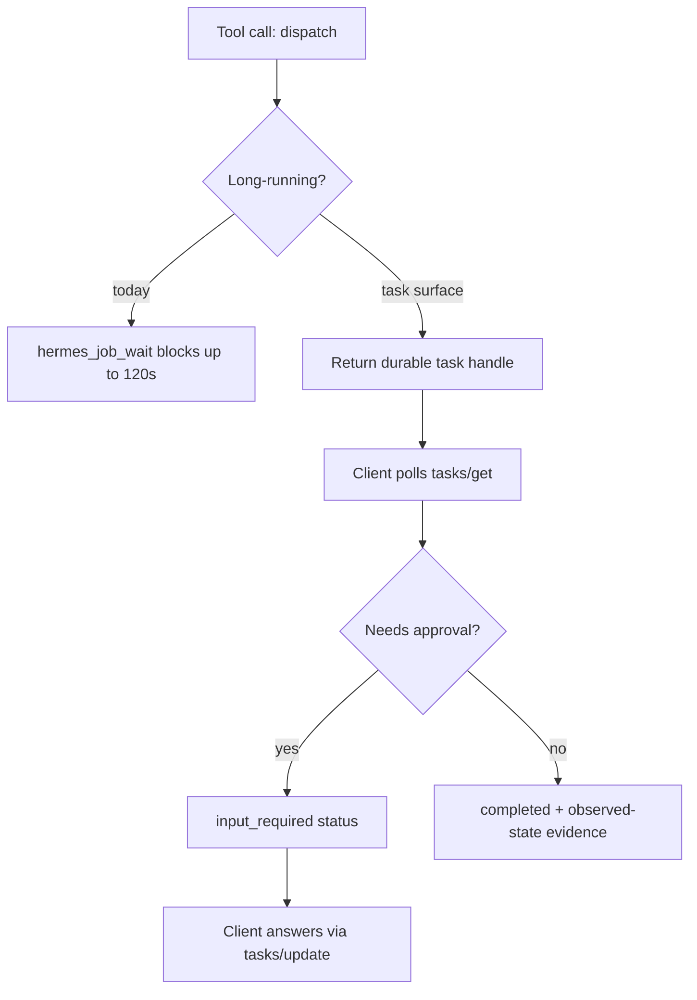
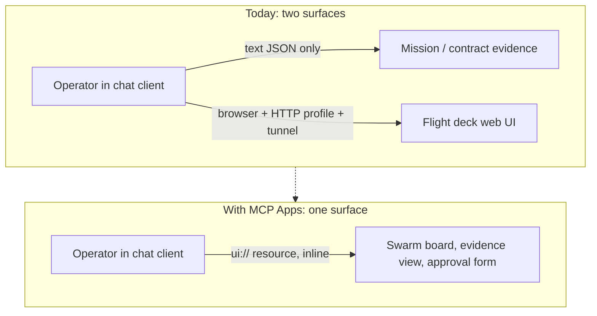

# Ideation: Repository Extension Candidates for hermes-gpt

---

## Grounding Context

### Codebase Context

hermes-gpt 0.8.0 ("Fabric") is a local-dev MCP sidecar exposing selected Hermes Agent capabilities: ~45 Python modules, `server.py` ~3.2k lines, built on the official MCP Python SDK (`pyproject.toml:16` pins `mcp[cli]>=1.0,<2`), Starlette + uvicorn. Protocol surface is pinned and verified by manifest: `docs/mcp-compatibility.md` declares verification against `mcp` 1.28.1 with protocol revisions through `2025-11-25`, asserted at test time by `test_mcp_compat.py`. Boundaries by invariant: loopback default, read-only default, dry-run-first mutation, direct mode per-call gates, Owner Mode break-glass, no raw prompts in audit.

Key surfaces: workspace read/export (`operator_export.py`), sessions, Mission Control (12 read-only surfaces, ~80 `hermes_mission_*` tools registered at `server.py:1474+`), work contracts validated fail-closed from observed state (`operator_contract.py`), durable delegations + job supervisor (`hermes_delegation_*` at `server.py:1503-1507`; `hermes_job_status`/`hermes_job_wait` at `server.py:2059-2076`, where wait long-polls up to 120 seconds inside a single tool call), runner backends (`operator_runners.py:625-636` fans out to registered backends; fabric/g4c/router register only through import side effects at `operator_recovery.py:25-27`), bounded swarm orchestration with a final human gate (`operator_swarm.py:134-147`), a hand-rolled A2A-shaped fabric peer (`operator_fabric.py:2802-2840` serves an agent card claiming `protocolVersion: "1.0"` and accepts both `SendMessage` and `message/send`), bwrap confinement (`runner_confinement.py`) and a systemd-run write guard (`fabric_write_guard.py`), a skills surface (`operator_skills.py:257-287` validates SKILL.md frontmatter; `server.py:808-891` already implements progressive disclosure via `hermes_skill_list`/`hermes_skill_view`), cron, a WebSocket live-events feed, and a 1,801-line flight-deck web UI (`ui_api.py`, `ui_missions.py`, `ui_fabric.py`, `ui_chat.py`, `ui_ops.py`) that requires a browser plus the HTTP profile or a tunnel.

### External Context

Research value: high — the upstream protocol stack moved a major version under this repo between its last verification and today.

- **MCP Python SDK v2.0.0 went stable 2026-07-28** (2.1.1 current as of 2026-08-25; PyPI). **v1.x is now maintenance-only, security fixes only**; upstream's own guidance for un-migrated projects is to keep a `<2` upper bound — which `pyproject.toml:16` already does. Breaking changes that land on this repo verbatim: `mcp.server.fastmcp` is gone (`FastMCP` → `MCPServer`, hit at `server.py:663` and `codex_mcp.py:8`); transport parameters moved off the server constructor (hit at `server.py:2720-2731`, which passes `host`, `port`, `sse_path`, `message_path`, `stateless_http`, `json_response`); pydantic fields renamed camelCase → snake_case (hit at `operator_export.py:172,180,181,205,206` via `mimeType`/`structuredContent`/`isError`); httpx → httpx2 and sse-starlette jumps two majors; OpenTelemetry becomes a hard dependency; request bodies over 4 MiB are rejected; handler exception text is no longer leaked to clients.
- **MCP specification revision 2026-07-28** removed protocol sessions and the `initialize` handshake, added `server/discover`, replaced resource subscription with `subscriptions/listen`, introduced Multi Round-Trip Requests (`InputRequiredResult`/`inputResponses` replacing server-initiated elicitation), required `ttlMs`/`cacheScope` cache hints on list results and deterministic `tools/list` ordering for client prompt-cache hit rates, reclassified the HTTP+SSE transport as Deprecated, deprecated Roots/Sampling/Logging, and moved **tasks** into an official extension (`io.modelcontextprotocol/tasks`, SEP-2663; full spec in `modelcontextprotocol/ext-tasks`).
- **MCP Tasks is upstream's standard for exactly this repo's shape**: durable handles instead of blocking, crash-resilient polling via `tasks/get`, mid-flight `input_required` status answered by `tasks/update` — with "human approvals" named as a motivating case. The SDK's v2.0.0 release notes list the tasks extension as not-yet-shipped (its one known gap), while v2's pluggable extension APIs ship with MCP Apps built in.
- **MCP Apps became an official extension 2026-01-26** (`modelcontextprotocol/ext-apps`): servers declare UI resources under the `ui://` scheme (`text/html;profile=mcp-app`), associate them with tools through metadata, and get bidirectional communication over the existing JSON-RPC base. It grew out of OpenAI's Apps SDK (Nov 2025) and renders in Claude, ChatGPT, and other compliant hosts.
- **A2A v1.0 shipped 2026-04-09 under Linux Foundation governance** with official SDKs in Python, JavaScript, Java, C#, and Go.
- **Agent Skills is an open standard** (`agentskills/agentskills`, Agentic AI Foundation) adopted by 30+ tools including Claude Code, Codex CLI, and Cursor — one SKILL.md format across tools.
- **ChatGPT now has Developer mode, apps, and full MCP connectors (beta)**, with OpenAI's own Secure MCP Tunnel for private/on-prem MCP servers — the exact path `docs/openai-secure-mcp-tunnel.md` documents.
- **Python 3.10 reaches end of life 2026-10-31** (endoflife.date) while `pyproject.toml:10` declares `requires-python = ">=3.10"` and line 21 carries a `tomli` conditional dependency that exists only for 3.10.
- **The orchestration-framework market consolidated** (LangGraph, CrewAI, AG2, OpenAI Agents SDK, Google ADK) around orchestration breadth — none of them own verified, fail-closed delegation from observed state, which remains this repo's differentiator.

---

## Topic Axes

- MCP protocol surface
- Trust and access boundary
- Delegated execution and interop
- Operator experience and packaging

---

## Ranked Ideas

Jump list: [1](#1-mcp-2026-07-28-conformance-program-sdk-v2-migration) · [2](#2-mcp-tasks-surfaces-for-delegations-jobs-and-swarm-stages) · [3](#3-governance-ui-over-mcp-apps-mission-control-inline-in-the-chat-client) · [4](#4-oauth-21-conformance-pack-for-the-operator-boundary) · [5](#5-agent-skills-open-standard-conformance-and-cross-tool-portability) · [6](#6-proof-carrying-delegation-evidence) · [7](#7-runtime-floor-and-packaging-refresh-python-311)

### 1. MCP 2026-07-28 conformance program (SDK v2 migration)

**Description:** Move the dependency from the maintenance-only v1 line to the SDK v2 major line and adopt the 2026-07-28 protocol revision, driven by the manifest that already exists. Concretely: `mcp[cli]>=2,<3`; `FastMCP` → `MCPServer` (`server.py:663`, `codex_mcp.py:8`); move `host`/`port`/`sse_path`/`message_path`/`stateless_http`/`json_response` off the constructor (`server.py:2720-2731`); rename the camelCase pydantic kwargs in `operator_export.py:172-206`; re-pin httpx2/sse-starlette; then refresh `docs/mcp-compatibility.md` to the new verified revision and add a drift guard so the manifest's "Verified against" line can never silently age again.

**Axis:** MCP protocol surface
**Basis:** direct: `pyproject.toml:16` pins `mcp[cli]>=1.0,<2`; `server.py:2707-2717` documents a private-API workaround (`server._mcp_server.version = VERSION`) that exists only because 1.28.x has no public version hook; `docs/mcp-compatibility.md:9` says "Verified: 2026-08-15 against `mcp` 1.28.1". external: the v2.0.0 release body states "v1.x is in maintenance mode and will only receive security fixes", and the 2026-07-28 spec changelog moves `serverInfo` into each result's `_meta` — which removes the need for that private-API hack outright.
**Rationale:** This is the one candidate that changes the cost of every other one. v2's extension APIs, OpenTelemetry, hardened stdio/auth, and multi-era wire support arrive in the same move, and the migration surface is unusually well-instrumented here: `test_mcp_compat.py` already asserts the protocol manifest against the installed SDK, so the upgrade is gated by tests that exist for exactly this purpose. Staying on v1 is not neutral — it means every future SEP lands as manual work.
**Downsides:** Largest blast radius of the set (two servers, transport wiring, type renames, dependency chain); the tasks extension is not in the SDK yet, so parts of the revision still need the extension APIs; the legacy SSE question has to be answered deliberately rather than by inertia.
**Confidence:** 92%
**Complexity:** High

### 2. MCP Tasks surfaces for delegations, jobs, and swarm stages

**Description:** Expose the repo's existing long-running state — delegations, durable jobs, swarm stages — through the standard `io.modelcontextprotocol/tasks` extension: a tool returns a durable task handle instead of blocking, clients poll `tasks/get`, and an approval gate moves the task to `input_required` answered by `tasks/update`. Keep the current `hermes_delegation_*`/`hermes_job_*` tools as the stable surface and layer the task handles over the same durable records, so work-contract validation becomes the standard "is this task actually complete" rule rather than a private convention.

**Axis:** MCP protocol surface
**Basis:** direct: `server.py:1503-1507` exposes five bespoke delegation polling tools, and `hermes_job_wait` (`server.py:2069-2076`) long-polls "for up to 120 seconds" inside a single tool call — a blocking pattern upstream explicitly named as the problem. external: the MCP Tasks overview lists "human approvals" as a motivating case and documents `input_required` + `tasks/update` as the mid-flight interaction, with "no long-lived connections" and "crash resilience" as the wins over blocking.
**Rationale:** Clients today spend context polling five differently-shaped tools, and a 120-second blocking call is exactly what many clients and intermediaries time out on. Standard task handles make hermes' long-running work legible to any compliant client without teaching it hermes' vocabulary, and the durable records this needs already exist — the change is an adapter, not a rework.
**Downsides:** Depends on idea 1's extension APIs or a hand-implemented extension contract while the SDK's tasks support catches up; task handles add a second identifier namespace beside delegation/job ids that must be kept coherent.
**Confidence:** 80%
**Complexity:** Medium

### 3. Governance UI over MCP Apps: Mission Control inline in the chat client

**Description:** Declare the flight deck's existing content — Mission Control overviews, work-contract evidence, swarm boards, approval forms — as `ui://` resources and associate them with the relevant tools, so the governance UI renders inline in Claude, ChatGPT, and other MCP Apps-compliant hosts instead of requiring a browser, the HTTP profile, and a tunnel. Start with the highest-value single surface (a swarm/approval card and a work-contract evidence view), since the web UI stays canonical for everything else.

**Axis:** Operator experience
**Basis:** direct: the flight deck is 1,801 lines across `ui_api.py`/`ui_missions.py`/`ui_fabric.py`/`ui_chat.py`/`ui_ops.py` and is reachable only through a browser plus the HTTP profile or a tunnel; mission evidence currently reaches the operator as JSON text in chat. external: MCP Apps (`modelcontextprotocol/ext-apps`, official extension since 2026-01-26) standardizes exactly this — `ui://` resources, tool metadata association, bidirectional JSON-RPC — and grew out of OpenAI's Apps SDK, so it renders in ChatGPT where this repo's users already connect through the Secure MCP Tunnel path documented in `docs/openai-secure-mcp-tunnel.md`.
**Rationale:** The repo's differentiator is verified, auditable delegation — but the evidence is currently behind a second surface most sessions never open. One investment renders that evidence where the operator already is, in any compliant client, and pairs naturally with idea 2's `input_required` approvals as an interactive form rather than a second tool call.
**Downsides:** Interactive UI from a tool widens the trust surface and must respect the repo's redaction posture (the UI layer already carries known gaps); host support varies, so the text surfaces must stay first-class; the flight deck's chat surface (`ui_chat.py`) has no standard equivalent.

**Confidence:** 75%
**Complexity:** Medium

### 4. OAuth 2.1 conformance pack for the operator boundary

**Description:** Bring the homegrown single-client OAuth to the current MCP authorization requirements: make PKCE mandatory in both directions (a code issued without a challenge is rejected; a verifier with no stored challenge is rejected), drop or honestly re-advertise the `none` token-endpoint auth method, emit and advertise RFC 9207 `iss` in authorization responses, and validate the `resource` parameter against the configured canonical URI at request time instead of letting mismatches surface later as opaque token failures.

**Axis:** Trust and access boundary
**Basis:** direct: `oauth_auth.py:293-294` guards the entire verifier check with `if challenge:`, `oauth_auth.py:606-608` accepts authorize requests with no `code_challenge`, and `oauth_auth.py:657` grants secretless auth on the mere presence of a `code_verifier` field — so a challenge-less code is redeemable with an arbitrary verifier and no secret; `oauth_auth.py:555` advertises auth method `none` while `docs/oauth.md:21` says it is not supported; `oauth_auth.py:603` accepts any caller-supplied `resource` with a silent fallback. external: the 2026-07-28 authorization spec requires OAuth 2.1, RFC 9207 `iss` emission and validation, and RFC 8707 resource indicators, and signals upgrading `iss` from SHOULD to MUST.
**Rationale:** Where OAuth is deployed it is the entire network boundary (`docs/oauth.md:3`), so conformance here is not paperwork — the PKCE chain above is a demonstrated bypass, and the spec's requirements are the fixed version of it. This is also the cheapest high-confidence candidate in the set: the gaps are localized in one module with an existing 30-test suite to extend.
**Downsides:** None material; the only real cost is that tightening PKCE can break clients that legitimately omit it, which the discovery metadata makes visible (`code_challenge_methods_supported` already says S256 only).
**Confidence:** 88%
**Complexity:** Medium

### 5. Agent Skills open-standard conformance and cross-tool portability

**Description:** Make the skills surface conform to the Agent Skills open standard and prove portability: validate SKILL.md against the published spec rather than a local convention, ensure hermes-authored skills round-trip into Claude Code / Codex CLI unchanged, and finish the in-flight searchable progressive discovery as a standard-shaped discovery surface instead of a hermes-only one.

**Axis:** Operator experience
**Basis:** direct: `operator_skills.py:257-287` already validates YAML frontmatter in the standard's exact shape and `server.py:808-891` already implements progressive disclosure (`hermes_skill_view` — "progressively load only the relevant"); the unmerged branch `feat/chatgpt-skill-discovery` (commit c2822d4, +118 lines `server.py`, +74 lines `test_skill_discovery.py`) is the same direction, half-built. external: the Agent Skills standard (`agentskills/agentskills`, Agentic AI Foundation) is adopted by 30+ tools including Claude Code, Codex CLI, and Cursor, making SKILL.md the portable unit rather than a per-tool convention.
**Rationale:** The repo is one conformance test away from skills authored here working everywhere and skills authored elsewhere working here — a compounding win, since every skill written against the standard arrives free. The in-flight branch shows the gap is already felt; landing it as a standard-shaped surface rather than a bespoke one is the difference between a feature and a fork.
**Downsides:** The standard's optional fields evolve, so conformance needs a tracked reference; import of foreign skills must route through the existing secret-path policy rather than trusting imported files.
**Confidence:** 80%
**Complexity:** Medium

### 6. Proof-carrying delegation evidence

**Description:** Make delegation outcomes carry their own verification: content-address the evidence chain (audit records and peer evidence digests, building on the sha256 digests fabric already computes), then export a self-contained verification bundle for a completed delegation — the durable record, the observed-state evidence the contract validated against, and the digest chain — so a third party (a peer, an auditor, a future session) can re-verify the work contract without re-trusting the operator's own summary. Streaming the audit read falls out of the same change.

**Axis:** Delegated execution and interop
**Basis:** direct: `operator_contract.py:656-671` validates contracts by parsing the entire audit JSONL into memory and then slicing the last N records (measured at 18.6 MB / 200k records: ~560 ms per validate, twice per call), so evidence access is both the performance cliff and the verification path; fabric already anchors policy evidence with sha256 (`operator_fabric.py` forbidden-policy digest). reasoned + external: the SLSA/in-toto provenance model shows the general pattern — attestations over artifacts let a verifier check a claim without re-running the work — and it maps cleanly here because the repo already validates from observed state rather than trusting self-report.
**Rationale:** The repo's identity is "completion is validated from observed state and fails closed" — but today that verification is only replayable inside the process that performed it. Making the evidence chain content-addressed turns an internal guarantee into a portable one, which is exactly what cross-agent delegation (A2A peers, Codex reviewers, human auditors) needs, and it collapses a known performance problem as a side effect.
**Downsides:** Highest design risk in the set: digest-chain design, what a bundle may safely contain (raw prompts must stay out by invariant), and export surface all need decisions; near-term user value is smaller than ideas 1-4.
**Confidence:** 62%
**Complexity:** High

### 7. Runtime floor and packaging refresh (Python 3.11+)

**Description:** Raise `requires-python` to 3.11 (or 3.12), drop the `tomli` conditional dependency that exists only for 3.10, and re-verify the dependency floor against the current stack in the same pass as idea 1's re-pin.

**Axis:** Operator experience and packaging
**Basis:** direct: `pyproject.toml:10` declares `requires-python = ">=3.10"` and `pyproject.toml:21` carries `tomli; python_version < '3.11'`. external: Python 3.10 reaches end of life 2026-10-31 (endoflife.date), eight weeks from this document's date; both SDK lines still support 3.10 today, so the floor is the repo's own choice to move.
**Rationale:** Cheapest candidate with a hard deadline. Shipping a supported-runtime claim past October means either accepting an EOL interpreter for a security-sensitive boundary or rushing the bump later; doing it alongside idea 1's dependency churn avoids a second packaging pass.
**Downsides:** Excludes users pinned to 3.10; trivial otherwise.
**Confidence:** 92%
**Complexity:** Low

## Rejection Summary

| # | Idea | Reason Rejected |
|---|------|-----------------|
| 1 | Drop the legacy SSE transport | Spec reclassified it Deprecated, not removed; the compat matrix retains it deliberately for older clients, so the decision belongs inside idea 1's manifest refresh, not as a standalone cut |
| 2 | Delete the superseded fabric peer-evidence path | Already recorded as remediation in the assess artifacts (`/tmp/assess-b8d9d3e9/report-attempt2.md`, finding N3); maintenance, not an extension candidate |
| 3 | Auto-generate the secret-path deny-list | Same — recorded as an assess P1 remediation; no new capability beyond the fix |
| 4 | A2A-only headless fleet node (zero MCP clients) | Subject drift: contradicts the local-dev sidecar identity and the loopback-default invariant; the fabric peer already carries the interop role |
| 5 | Fleet-scale write-guard/registry queueing | No evidence of the pain in this deployment shape; ungrounded speculation about a scale the repo does not serve |
| 6 | Adopt LangGraph/CrewAI/AG2 for swarm orchestration | Those frameworks own orchestration breadth, not fail-closed verification from observed state; adopting one replaces the repo's differentiator instead of extending it |
| 7 | Rebuild the fabric peer on the official A2A v1.0 SDK | Rewrite adds a dependency and surface for no user-visible capability; the peer's determinism and zero-dependency design is the point — conformance-check the card and methods against the v1.0 SDK instead |
| 8 | `subscriptions/listen` event stream for job/delegation state | Merged into idea 2 — the task surface and the subscription stream are one standard adoption, not two roadmap items |
| 9 | OpenTelemetry adoption; deterministic `tools/list` ordering + `ttlMs`/`cacheScope` cache hints | Merged into idea 1 — all three arrive with the SDK/spec revision and add no independent decision |
| 10 | W3C Verifiable Credentials for delegation evidence | Merged into idea 6 as a variant; the content-addressed bundle framing is the smaller first step, VC is a later escalation if portability demands it |
| 11 | Verify the ChatGPT Developer-mode connector path end to end | Merged into idea 3 — same surface, same tunnel path documented in `docs/openai-secure-mcp-tunnel.md`; not a separate candidate |
| 12 | Generalize the second-reader gate to A2A peers | Below the meeting-test floor as stated: a pattern observation without a specific surface it lands on; revisit after idea 6 shapes the evidence model |
